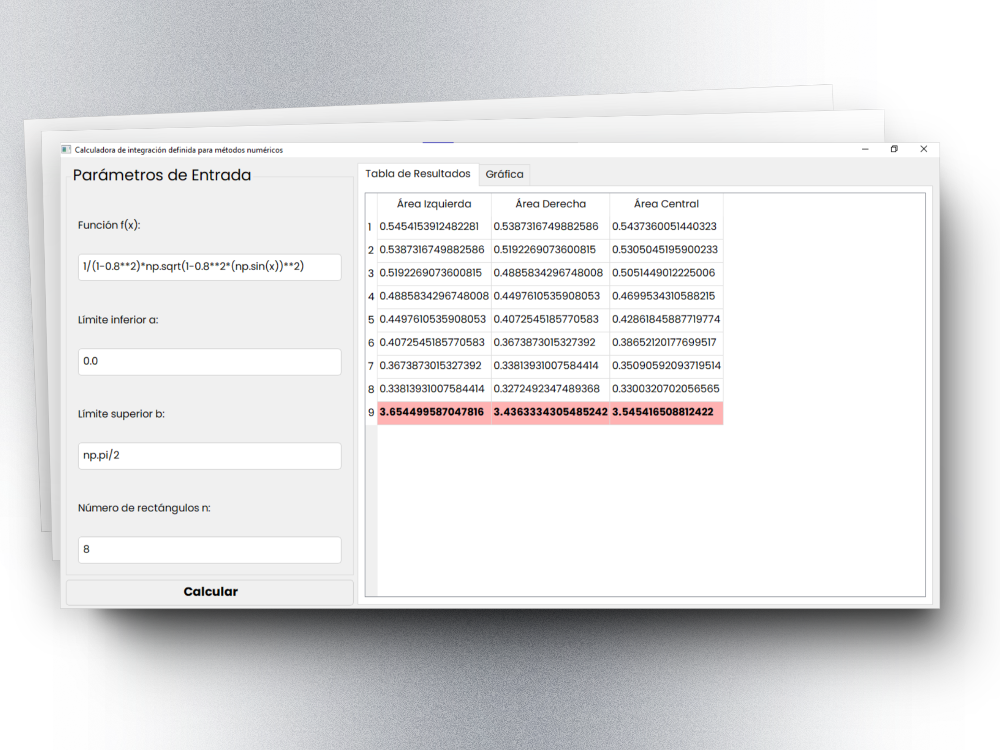
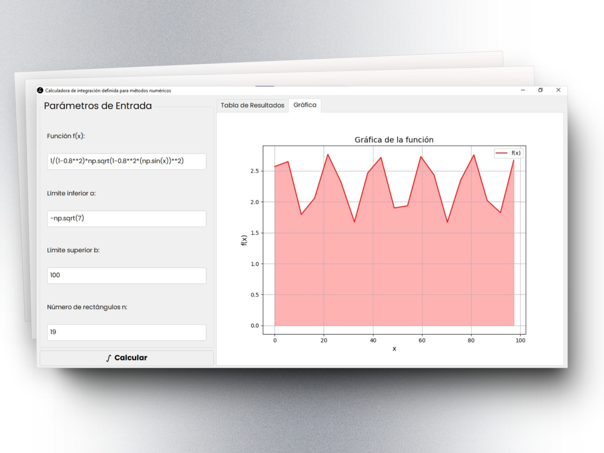

# **IntegralApp**

Welcome to **IntegralApp**, your intuitive tool for exploring numerical integration with precision and ease! 📊

---

## **Overview**

**IntegralApp** is a Python-based GUI application designed to simplify the calculation of definite integrals using numerical methods. With a sleek interface and powerful tools, it enables users to visualize and understand integration concepts interactively.

This application is perfect for students, educators, and professionals working with numerical methods.

---

## **Features**

- 🖥️ **Interactive GUI**: Powered by PyQt5 for a modern and seamless user experience.
- 📈 **Graphical Representation**: Visualize functions and their numerical approximations.
- 📊 **Detailed Tables**: View calculations for left, right, and midpoint methods.
- 🎯 **Customizable Parameters**: Easily input functions, limits, and number of subdivisions.
- 💾 **Standalone Execution**: Run directly on Windows without additional installations.

---

## **Screenshots**

*Figure 1: Tabular results with highlighted total areas.*

*Figure 2: Function graph and shaded approximations.*

---

## **Getting Started**

### **System Requirements**
- **Operating System**: Windows 10/11 (64-bit)
- **Python**: Not required for `.exe` version.

### **Installation**
1. Download the latest `.exe` file from the [Releases](https://github.com/StevenTete/integral-app/releases) page.
2. Save the file in your desired directory.
3. Double-click the `.exe` to launch the app.

---

## **Usage**

1. **Input Parameters**:
   - Enter the function `f(x)` in Python syntax (e.g., `np.sin(x)`, `x**2`).
   - Specify the lower (`a`) and upper (`b`) integration limits.
   - Set the number of subdivisions (`n`) for better accuracy.
2. **Calculate**:
   - Click the **"Calculate Integral"** button.
3. **View Results**:
   - Check the **Results Table** tab for numerical approximations.
   - Explore the **Graph** tab to visualize the function and shaded areas.

---

## **Feedback**

Your feedback is invaluable! If you encounter issues or have feature requests, please [open an issue](https://github.com/StevenTete/integral-app/issues).

---

*IntegralApp - Simplifying Numerical Integration for Everyone.* 🎓
